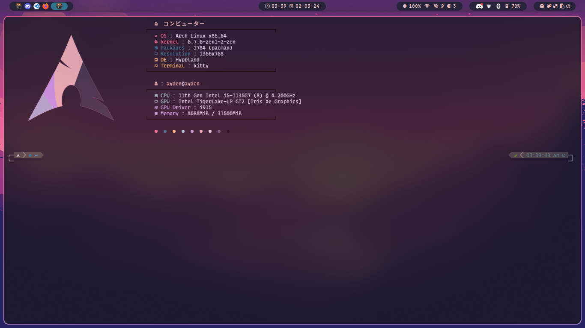
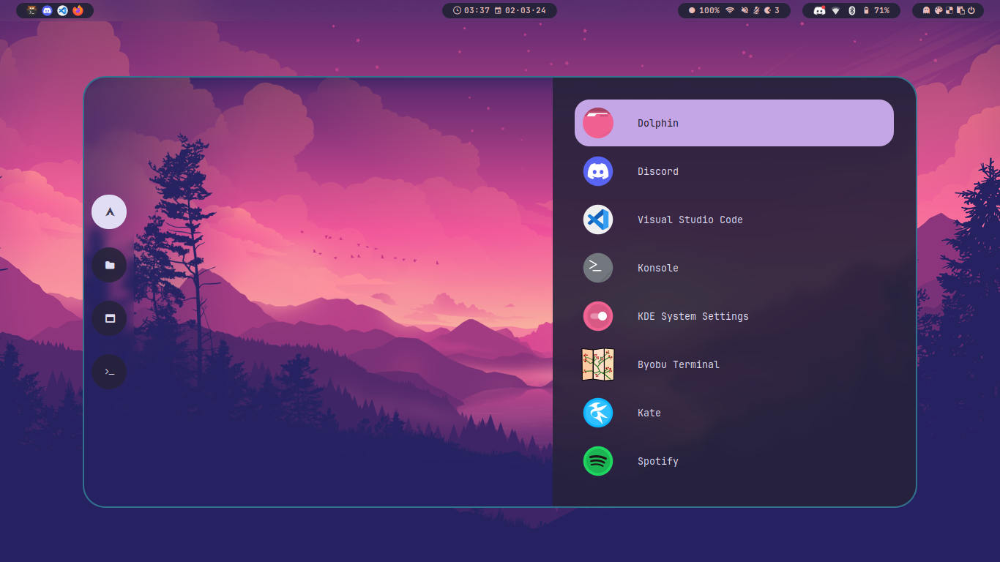

# 💻 Dotfiles

Welcome to my dotfiles repository where I keep all my configuration files in one place.

## 🛠️ Setup

### Install YADM

YADM is a tool for managing dotfiles. Install it using the package manager:

```bash
# Arch Linux
sudo pacman -S yadm
```

### Clone Dotfiles

Clone this repository using YADM:

```sh
# Clone with HTTPS
yadm clone https://github.com/aydenjahola/dotfiles.git

# Clone with SSH
yadm clone git@github.com:aydenjahola/dotfiles.git
```

## Showcase




